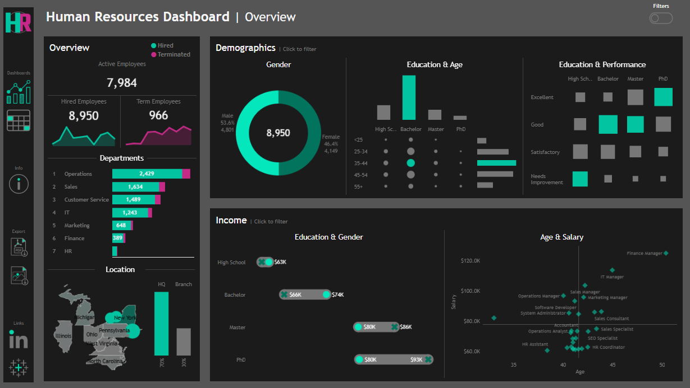
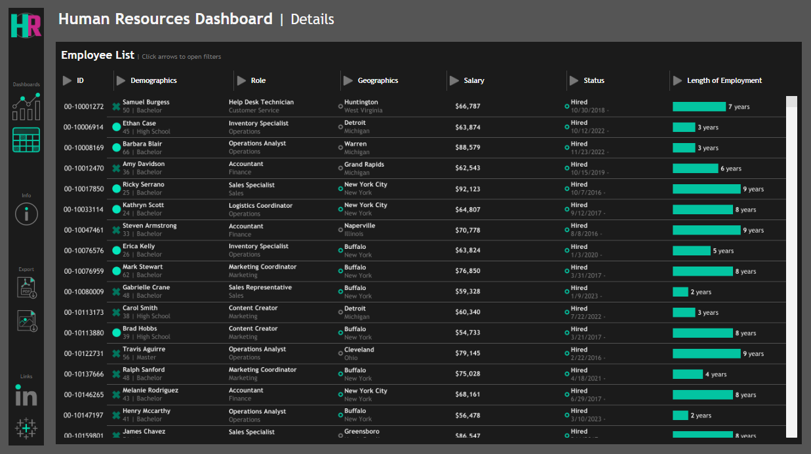

# HR_Dashboard

## Introduction

This user story outlines the specifications for building two dashboards using tableau to help The HR manager to analyze workforce metrics, track employee demographics, and evaluate income trends for informed decision-making. 

## Data Source

- Where is the data coming from?

The data is generated using a combination of ChatGPT prompts and the Python Faker library. This dataset simulates a set of employee information typically found in HR systems, including demographics, job details, salary, performance evaluations, and attrition data. The generated data is designed to mimic real-world HR data, providing a rich dataset for analysis and visualization in Tableau.

## HR Dashboard | Requirements

### Dashboard Purpose

The purpose of the HR dashboard is to analyze human resources data, providing both summary views for high-level insights and detailed employee records for in-depth analysis

- Dashboard Link [see here to find it.](https://public.tableau.com/views/HRAnalysis_17399784596760/HRDashboard?:language=en-GB&:sid=&:redirect=auth&:display_count=n&:origin=viz_share_link)

- The Photo of HR Dashboard

### Key Requirements

#### Overview

The Overview section should provide a snapshot of the overall HR metrics, including:

- Display the total number of hired employees, active employees, and terminated employees.

- Visualize the total number of hired and terminated employees over the years.

- Present a breakdown of total employees by department and job titles.

- Compare total employees between headquarters (HQ) and branches (New York is the HQ)

- Show the distribution of employees by city and state.

#### Demographics

The Demographics section should offer insights into the composition of the workforce, including:

- Present the gender ratio in the company.

- Visualize the distribution of employees across age groups and education levels.

- Show the total number of employees within each age group.

- Show the total number of employees within each education level.

- Present the correlation between employees’s educational backgrounds and their performance ratings.

#### Income

The income analysis section should focus on salary-related metrics, including:

- Compare salaries across different education levels for both genders to identify any discrepancies or patterns.

- Present how the age correlate with the salary for employees in each department.

## HR Details | Requirements

### Dashboard Purpose
Provide a comprehensive list of all employees with necessary information.

- The Photo of Customer Dashboard

### Key Requirements

#### Employees List
Provide a comprehensive list of all employees with necessary information such as name, department, position, gender, age, education, and salary.

#### List Filters
Users should be able to filter the list based on any of the available columns.

## Design & Interactivity Requirements

### Dashboard design

The dashboard should be in a dark theme.

### Data Filters

Allow users to filter data by Gender, Location, Status and Year of hired date.

